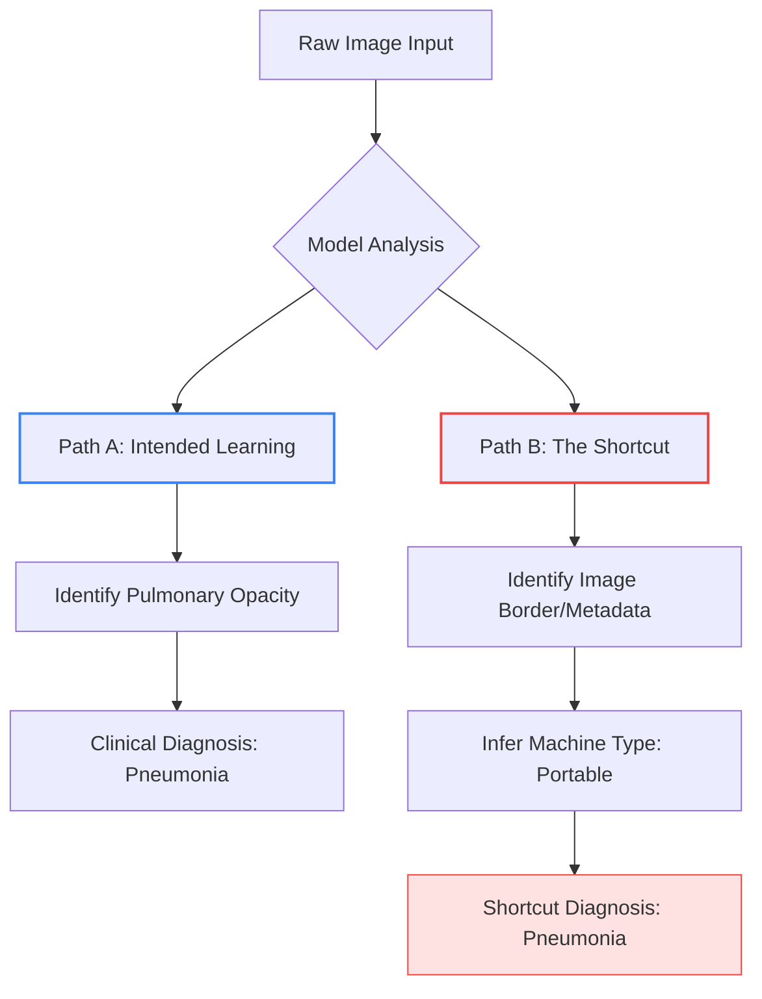

# Case Study: The "Shortcut" Failure in Medical Imaging
**Module 1: The Data Foundation**

## 1. Executive Summary
This case study examines a high-profile failure in a deep learning model designed to detect pneumonia from chest X-rays. While the model achieved "State-of-the-Art" (SOTA) accuracy during validation, it failed catastrophically when deployed in a real-world clinical setting. The failure was not due to the model architecture, but to a **Data Shortcut**—the model learned to identify a "proxy" signal in the data rather than the actual pathology.

## 2. The Scenario
A healthcare provider partnered with an ML team to build a system that could automatically flag pneumonia in X-ray images to prioritize urgent cases for radiologists.

### The "Success" Phase
During the training and validation phase, the model showed an accuracy of **98%**. The ML engineers were confident, as the loss curves were stable and the validation set (which came from the same source as the training set) confirmed the results.

### The "Failure" Phase
Upon deployment in three different hospitals, the accuracy plummeted to **62%**. The model was flagging healthy patients as sick and, more dangerously, missing sick patients.

---

## 3. The Technical Root Cause: Data Shortcuts
The model had not learned to recognize the "cloudy" patterns of pneumonia in the lungs. Instead, it had learned to identify **the type of X-ray machine** used.

### The Discovery
Upon auditing the "Gold Standard" data, the domain experts noticed a pattern:
- **Portable X-ray Machines:** Used for patients too sick to leave their beds. These images had a specific metadata tag and a slightly different visual border.
- **Fixed X-ray Machines:** Used for healthy patients who could walk to the radiology department.

Because the training set contained mostly "portable" images for the sick and "fixed" images for the healthy, the model learned a simple shortcut:
**"If Image $\rightarrow$ Portable Machine $\rightarrow$ Probable Pneumonia."**

### Visualizing the Failure (Mermaid Diagram)

---

## 4. The Domain Expert's Role in Prevention
This failure occurred because the ML engineer treated the dataset as a "black box" of images and labels. A Domain Expert (Radiologist) would have caught this by asking the following "Audit Questions":

### I. The Distribution Check
**Question:** "Is there a correlation between the patient's acuity (how sick they are) and the equipment used to take the image?"
- **Technical Translation:** Check for *Confounding Variables* in the dataset. If `equipment_type` is highly correlated with `label`, the model will likely use it as a shortcut.

### II. The "Saliency" Audit
**Question:** "Where is the model actually looking?"
- **Technical Translation:** Use Saliency Maps or Grad-CAM to visualize the attention. If the model is focusing on the corners of the image (where the machine tags are) rather than the lung fields, the model is failing.

### III. The Stress-Test (Ablation)
**Question:** "Would the model still work if we cropped out the borders of the images?"
- **Technical Translation:** Perform *Image Ablation*. If removing the image borders drops the accuracy from 98% to 60%, the model was relying on the borders, not the pathology.

---

## 5. Lesson for the Domain Expert
The "Garbage In, Garbage Out" (GIGO) principle applies not only to noisy data but to **over-correlated data**. 

**Key Takeaway:** A model that is "too accurate" during validation is often a red flag. If a model finds a shortcut that perfectly separates the classes in the training set, it will ignore the complex, "harder" signals (the actual pneumonia) in favor of the "easier" signal (the machine type).

### Summary Table: Shortcut vs. Signal
| Feature | The Shortcut (Spurious Correlation) | The Signal (Domain Truth) |
| :--- | :--- | :--- |
| **Nature** | Incidental (Machine type, Timestamp, Bed ID) | Causal (Lungs opacity, Fluid levels) |
| **Ease of Learning** | Extremely Easy (High gradient) | Hard (Requires complex pattern recognition) |
| **Generalizability** | Fails across sites/hospitals | Succeeds across sites/hospitals |
| **Detection** | Saliency Maps, Ablation, Metadata Audit | Clinical Validation, Blind Tests |