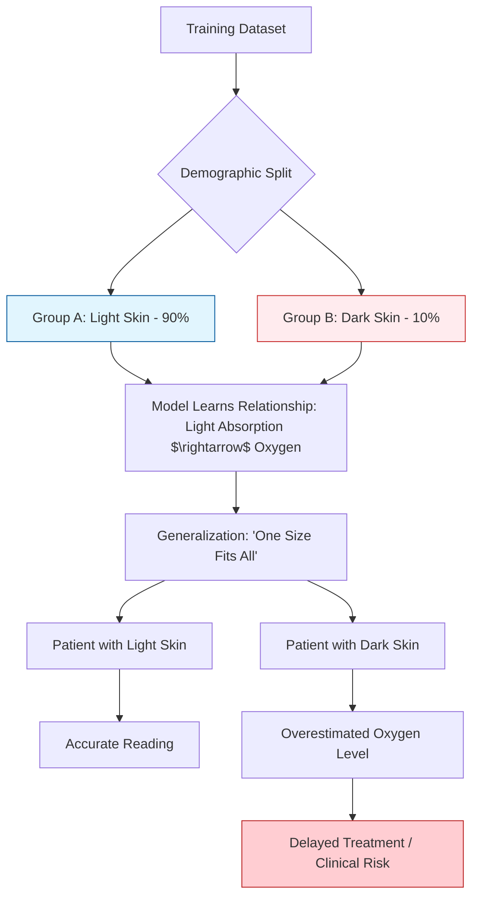

# Case Study: Representation Bias in Pulse Oximetry AI
**Module 1: The Data Foundation**

## 1. Executive Summary
This case study explores the failure of pulse oximetry devices and the subsequent ML models used to analyze their data. Pulse oximetry is used to measure oxygen saturation ($\text{SpO}_2$) in the blood. It was discovered that these systems consistently overestimated oxygen levels in patients with darker skin tones, leading to delayed treatment for hypoxia in Black and Hispanic patients. This is a classic example of **Representation Bias**—where the "Gold Standard" data used to calibrate the system was not representative of the entire population.

## 2. The Scenario
A medical technology company developed an AI-driven monitoring system that integrated pulse oximetry data to trigger alerts for nursing staff when a patient's oxygen levels dropped below a critical threshold.

### The "Validation" Phase
The model was validated using a large dataset of historical patient records. The results showed high accuracy across the overall population. The engineers reported that the model was "statistically sound" and ready for deployment.

### The "Clinical" Failure
In practice, clinical staff noticed a disturbing trend: Black patients were frequently experiencing severe respiratory distress (hypoxia) *before* the AI system triggered an alert. In many cases, the AI indicated the patient was "stable" ($\text{SpO}_2 \approx 94\%$) while clinical signs (cyanosis, shortness of breath) indicated critical failure ($\text{SpO}_2 < 88\%$).

---

## 3. The Technical Root Cause: Representation Bias
The failure was rooted in the physics of the sensor and the bias in the training data.

### The Physics Problem
Pulse oximeters work by emitting two wavelengths of light (red and infrared) through the skin. The sensor measures how much light is absorbed. However, melanin (the pigment in darker skin) absorbs light differently than lighter skin.

### The Data Failure
The "Gold Standard" datasets used to calibrate the sensors and train the ML models were overwhelmingly composed of data from Caucasian patients. 

**The Bias Loop:**
1. **Under-representation:** The training set lacked sufficient samples from diverse skin tones.
2. **Implicit Assumption:** The model assumed the relationship between light absorption and oxygen saturation was universal.
3. **Systemic Error:** For darker skin, the model misinterpreted the light absorption caused by melanin as "higher oxygen," creating a consistent **positive bias error**.

### Visualizing the Bias (Mermaid Diagram)

---

## 4. The Domain Expert's Role in Prevention
A Domain Expert (Physician or Bio-Medical Engineer) would have recognized that the "Human" in the data is a biological variable, not a constant.

### I. The Stratified Audit
**Question:** "Does the model perform equally well across different demographic subgroups?"
- **Technical Translation:** Perform **Stratified Performance Analysis**. Instead of looking at "Global Accuracy," calculate the Mean Absolute Error (MAE) specifically for different skin tones. If the error is skewed toward one group, the data is unrepresentative.

### II. The "Ground Truth" Validation
**Question:** "What is the true gold standard for oxygen saturation?"
- **Technical Translation:** Compare the pulse oximetry readings against **Arterial Blood Gas (ABG)** tests (the clinical gold standard). If the $\text{SpO}_2$ reads 94% but the ABG reads 88%, the sensor/model has a systemic bias.

### III. Diversity Engineering
**Question:** "Is our training set a mirror of the population we are treating?"
- **Technical Translation:** Implement **Data Balancing**. If the population is 30% Black, the training set must be at least 30% Black to ensure the model learns the physics of light absorption for that group.

---

## 5. Lesson for the Domain Expert
Bias is not always about "prejudice"; in ML, bias is often a **sampling failure**.

**Key Takeaway:** "Representative Data" is not just about having *some* samples of a group; it is about having *enough* samples to capture the underlying variance of that group. When a model is deployed in a diverse human population, the Domain Expert must ensure the data represents the biological and social diversity of the target end-user.

### Summary Table: Representation Bias vs. Noise
| Feature | Representation Bias | Random Noise |
| :--- | :--- | :--- |
| **Pattern** | Systemic (Consistent error for a specific group) | Stochastic (Random error across all samples) |
| **Impact** | Unfair / Harmful outcomes for subgroups | General decrease in model precision |
| **Detection** | Disaggregated Analysis / Stratified Testing | Error Variance / Standard Deviation |
| **Fix** | Targeted Data Collection / Balancing | Data Cleaning / Filtering |