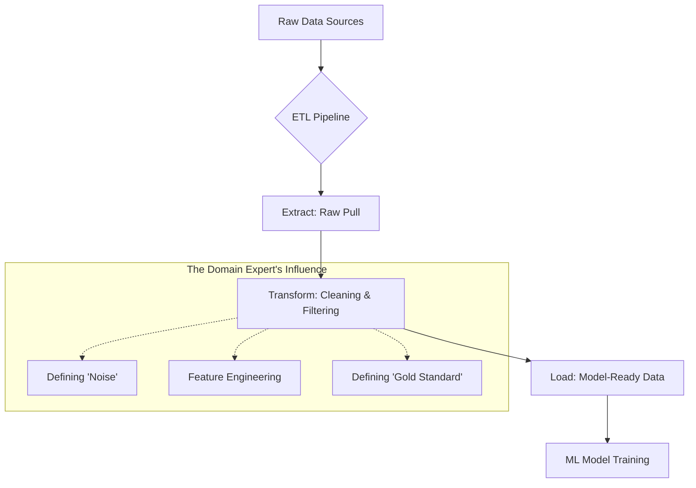

# Lab: The Data Foundation (Module 1)

## 1. Overview
Welcome to your first hands-on exploration of the ML pipeline. In this lab, we move beyond the theory of "data" and explore the actual process of transforming raw, messy information into a format that a machine learning model can actually "digest."

As a Domain Expert, your primary lever for improving a model is not the code, but the **Data**. If the data is biased, incorrect, or missing key signals, the most advanced architecture in the world will still produce "garbage" outputs (the "Garbage In, Garbage Out" principle).

### Learning Objectives
By the end of this lab, you will be able to:
- Distinguish between structured and unstructured data.
- Map the journey of data from a source system to a model.
- Identify the difference between "Real-world" and "Synthetic" data.
- Understand how to curate a "Gold Standard" dataset.

### Prerequisites
Before starting this lab, please review:
- **Textbook Chapter 1:** The Symbiosis of Domain Expertise and ML.
- **Textbook Chapter 2:** The ML Landscape for Engineers.

---

## 2. The Data Journey (The ETL Pipeline)

Before a model can see data, that data must undergo a process called **ETL**. 

### What is ETL?
**ETL** stands for **Extract, Transform, and Load**. It is the plumbing of the ML world.

- **Extract:** Pulling raw data from its source (e.g., a SQL database, a CSV file, a PDF, or a live sensor feed).
- **Transform:** Cleaning the data. This involves removing duplicates, handling missing values, and converting formats.
- **Load:** Saving the cleaned data into a destination (like a Data Warehouse or a Model-Ready Tensor) where the ML model can access it.

### The Domain Expert's Role in ETL
An ML Engineer knows *how* to build an ETL pipeline, but they don't know *what* the data means. You are the only person who can tell the engineer:
- "This null value isn't missing data; it means the sensor was offline for maintenance."
- "This spike in the data is an outlier we should ignore because it was a measurement error."
- "This column is irrelevant for the prediction, but this other column is the key signal."

#### Visualizing the ETL Pipeline

---

## 3. The Taxonomy of Datasets

Not all data is created equal. Depending on the problem, you will deal with different "types" of data.

### Structured vs. Unstructured Data

| Type | Definition | Examples | Machine Perception |
| :--- | :--- | :--- | :--- |
| **Structured** | Data organized in a predefined format (rows and columns). | SQL Tables, Excel Sheets, JSON. | Easy to quantify; seen as "Features" (numbers). |
| **Unstructured** | Data that does not have a predefined data model. | PDFs, Images, Audio, Raw Text. | Complex; must be "vectorized" (turned into numbers) first. |

**Summary for Non-Experts: Vectorization**
Machines cannot "read" a PDF or "see" an image. They only understand numbers. **Vectorization** is the process of converting a piece of unstructured data (like a word or a pixel) into a list of numbers (a vector) that represents its meaning in a mathematical space.

### Real-World vs. Synthetic Data

**Real-World Data** is collected from actual observations. It is authentic but often "noisy" (contains errors) and can be expensive or slow to collect.

**Synthetic Data** is data generated by another model (e.g., using a GPT-4 model to generate 1,000 fake medical reports for training). 

#### The Risk: Model Collapse
A critical danger in using synthetic data is **Model Collapse**. This happens when a model is trained on data produced by another model. Over time, the "nuance" of the real world is lost, and the model begins to hallucinate a "simplified" version of reality. This is why the Domain Expert must ensure that synthetic data is grounded in real-world "Gold Standard" samples.

---

## 4. Data Curation and the "Gold Standard"

The most important part of your job in Module 1 is creating the **Gold Standard Dataset**.

### What is a Gold Standard?
A Gold Standard dataset is a small, perfectly curated set of data where the "ground truth" is verified by a human expert. 

If you are building a model to detect cracks in airplane wings:
- **Raw Data:** 1,000,000 images of wings.
- **Gold Standard:** 100 images where a senior engineer has manually circled the crack and verified its severity.

The ML Engineer uses the Gold Standard to "tune" the model and evaluate if it is actually working.

### Exercise: Conceptual Mapping
Imagine you are tasked with building an AI that predicts if a chemical reaction will be successful based on the ingredients and temperature.

1. **Identify the Raw Sources:** Where does the data live? (e.g., Lab notebooks, Digital logs).
2. **Define the Transformation:** What constitutes "noise" in this data? (e.g., typos in chemical names).
3. **Specify the Structure:** Is this structured (table of measurements) or unstructured (written reports)?
4. **Define the Gold Standard:** How many verified "successes" and "failures" do you need to prove the model works?

---

## 5. Summary Checklist
- [ ] I can explain the difference between Extract, Transform, and Load (ETL).
- [ ] I understand why a Domain Expert is critical for the "Transform" step.
- [ ] I can distinguish between Structured and Unstructured data.
- [ ] I can explain the danger of "Model Collapse" when using synthetic data.
- [ ] I can define a "Gold Standard" dataset for my specific domain.