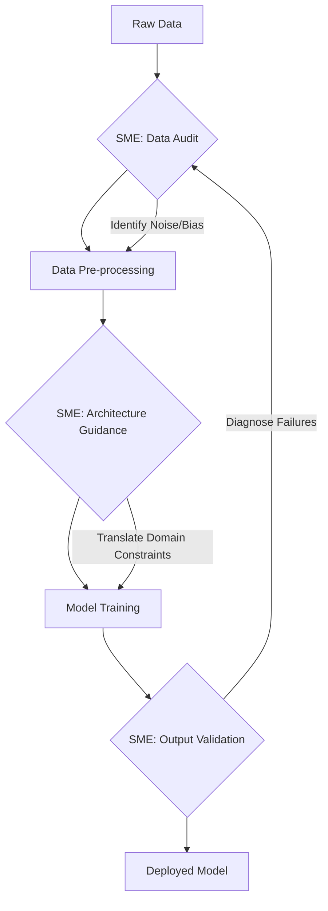

# Chapter 1: The Symbiosis of Domain Expertise and ML

In my experience, the most common point of failure in a technical project is not a lack of compute or a bug in the code; it is a communication gap. Specifically, it is the gap between the person who understands the problem (you, the Domain Expert) and the person who builds the solution (the ML Engineer). 

When we treat Machine Learning as a magic box that just "figures it out," we create a dangerous dependency. This chapter explores why that approach fails and how we can shift our relationship with AI from one of passive observation to active architectural guidance.

---

## 1.1 The "Black Box" Problem

In many professional circles, Machine Learning is treated as a "Black Box."

> **Black Box:** A system where the inputs and outputs are known, but the internal workings (the "how" and "why") are invisible or incomprehensible to the user.

The problem with this perspective is the assumption that if we feed a model enough data, it will naturally acquire the "intuition" of a professional. In general fields, this works. A model can learn to identify a cat in a photo because "cat-ness" is a general pattern. However, in specialized fields—like structural engineering, oncology, or quantitative finance—the patterns that matter are often invisible to a generalist model.

### Why Generalist Models Fail in Specialized Fields

A generalist model (like a base LLM) is trained on a massive, diverse dataset. It is an "average" of human knowledge. While this makes it broad, it introduces three critical failure points in specialized domains:

1. **The Noise-to-Signal Ratio:** In a specialized field, the most critical piece of information might be a single outlier in a dataset. A generalist model, trained to find the most common pattern, often dismisses this critical signal as "noise."
2. **Lack of Ground Truth:** Generalist models learn from the internet. If the internet contains common misconceptions about your field, the model will confidently reproduce those errors.
3. **The Context Gap:** A model may know the definition of a term but not the *implications* of that term in a real-world scenario. It understands the "what," but not the "so what."

**Example: Medical Diagnosis**
A generalist model might see a symptom and match it to the most common disease associated with that symptom in its training data. A doctor, however, knows that in a specific patient demographic, that symptom is a red flag for a much rarer, but more lethal, condition. The doctor is looking for the *exception*; the model is looking for the *average*.

---

## 1.2 The Role of the Subject Matter Expert (SME) in the ML Pipeline

To move beyond the black box, we need to integrate the Domain Expert (SME) into the "ML Pipeline."

> **ML Pipeline:** The end-to-end sequence of steps required to take raw data and turn it into a functioning model. This typically includes data collection, cleaning, training, and evaluation.

For too long, the SME was treated as a "data janitor"—someone who simply cleans data or labels images. In reality, the SME should be the architect's consultant at every stage.

### The Integrated Pipeline

In this integrated approach, your role shifts across three primary dimensions:

**1. Data Audit (The Filter)**
Instead of just providing data, you identify *what* data is actually representative. You tell the engineer: "This dataset is skewed because it only contains patients from urban clinics; it doesn't represent the rural population we are targeting."

**2. Architectural Guidance (The Blueprint)**
You help the engineer choose the right "tool" for the job. If you know that your domain requires extreme precision in specific areas and can tolerate errors in others, you guide the engineer toward specific architectures (like Mixture-of-Experts) rather than a one-size-fits-all approach.

**3. Output Validation (The Judge)**
When a model fails, an engineer sees a drop in a mathematical metric (e.g., "accuracy dropped 2%"). You see a *clinical* or *operational* failure. Your job is to translate that failure into a technical requirement.

---

## 1.3 From Intuition to Specification

The most frustrating phrase an ML engineer can hear is: *"This output feels wrong."*

As a domain expert, your intuition is your most powerful tool, but intuition is not a technical specification. Intuition is a signal that a pattern has been violated, but the engineer cannot "code" a feeling. To be an effective partner, you must translate that intuition into a specification.

### The Translation Process

When you encounter a model error, avoid the "feeling" and move toward the "mechanism."

| Intuition (The Feeling) | Specification (The Technical Requirement) |
| :--- | :--- |
| "The model is being too conservative." | "The model is over-weighting the penalty for False Positives; we need to adjust the decision threshold." |
| "It doesn't understand how this works." | "The model is failing to capture the temporal relationship between Event A and Event B." |
| "This looks like a hallucination." | "The model is filling gaps in the data with common internet patterns rather than referencing the provided knowledge base." |

**The Workflow for Translation:**
1. **Identify the Error:** Note exactly where the output diverged from the expected domain reality.
2. **Isolate the Variable:** Ask, "What specific piece of domain knowledge is missing here?"
3. **Define the Constraint:** Describe the rule that was broken. (e.g., "In this field, X can never happen after Y.")
4. **Propose the Technical Lever:** Suggest if this is a data problem (missing samples), a training problem (wrong objective), or an architectural problem (wrong model type).

---

## 1.4 Case Studies: Successes and Failures in Domain-Specific AI

To illustrate the importance of this symbiosis, let's look at two hypothetical but representative scenarios.

### Case A: The Failure of "More Data" (Legal Document Analysis)
A firm attempted to build an AI to identify "high-risk clauses" in contracts. They fed a generalist model 100,000 contracts. The model had high accuracy on common clauses but missed 90% of the truly high-risk ones.

**The Problem:** The high-risk clauses were rare (the "exception" problem). The model learned that the most "accurate" prediction was that the clause was low-risk, because that was the most common pattern in the data.

**The SME Intervention:** A legal expert identified that "risk" in these contracts is defined by specific linguistic markers that are rare but critical. Instead of more data, the SME created a "Gold Dataset"—a small, curated set of perfectly labeled high-risk examples—and guided the engineer to use a technique that penalized the model more heavily for missing those specific markers.

### Case B: The Success of "Architectural Alignment" (Precision Manufacturing)
A company wanted to predict tool failure in a factory. Generalist time-series models were inconsistent.

**The Problem:** The models treated all sensor data with equal weight. In reality, certain sensors (e.g., vibration) are only relevant when other sensors (e.g., temperature) reach a certain threshold.

**The SME Intervention:** The engineer didn't know the physics of the machine. The SME explained the conditional relationship between heat and vibration. This led the engineer to implement a "Gating Mechanism" in the model architecture, where the model only "listens" to vibration data when temperature exceeds a specific limit.

**The Result:** The model's precision increased dramatically because the architecture now mirrored the physical reality of the domain.