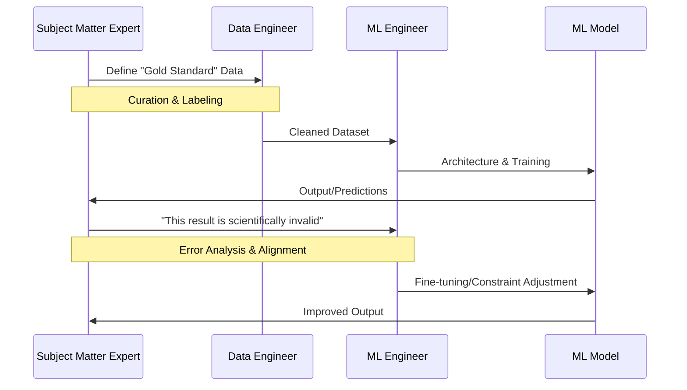

# Chapter 1: The Symbiosis of Domain Expertise and ML

Welcome. If you are reading this, you likely possess a deep, intuitive understanding of a specific field—be it structural engineering, organic chemistry, high-frequency trading, or clinical oncology. You have spent years mastering the nuances, the exceptions, and the "gut feelings" that define professional expertise. 

For a long time, the prevailing narrative in the AI world was that "data is the new oil." The assumption was that if we simply fed enough raw data into a powerful enough algorithm, the machine would "discover" the laws of your domain on its own. As a peer in this journey, I can tell you that this approach is fundamentally flawed.

Machine Learning (ML) is not a magic box that generates knowledge; it is a mathematical engine that recognizes patterns. If the patterns provided are incomplete, biased, or lack context, the engine will produce results that are mathematically "correct" (according to its training) but scientifically useless. This is where you come in. This chapter explores why the relationship between the Subject Matter Expert (SME) and the ML Engineer is not just helpful, but symbiotic.

---

## 1.1 The "Black Box" Problem: Why Generalist Models Fail in Specialized Fields

When we talk about "Generalist Models," we are referring to systems like the base versions of GPT-4 or Claude. These models are trained on a massive, diverse corpus of text—essentially the entire public internet. They are excellent at general tasks: summarizing a meeting, writing a generic email, or explaining basic physics.

However, when these models are applied to specialized fields, they encounter the "Black Box" problem. To the model, your domain's data is just another set of tokens. It doesn't understand the *physical laws* or *regulatory constraints* that govern your field.

### The Gap Between Generalization and Specialization

A generalist model operates on statistical probability. If it sees the word "Stress" in a general context, it might associate it with psychology. In your world—say, Civil Engineering—"Stress" refers to the internal force per unit area within a material.

> **Statistical Probability:** In the context of LLMs, this is the likelihood that a specific token (a piece of a word) follows another, based on patterns seen during training. It is an approximation of meaning, not a conceptual understanding.

When a generalist model fails in a specialized field, it doesn't usually fail by being "wrong" in a way that is obviously absurd. Instead, it fails through "hallucinations" that look plausible to a non-expert but are dangerous to a professional.

#### Visualizing the Specialization Gap

```mermaid
graph TD
    A[Generalist Model] --> B{Knowledge Base}
    B --> C[General Knowledge: High Accuracy]
    B --> D[Domain Knowledge: Low Density/Generic]
    
    E[Domain Expert] --> F{Knowledge Base}
    F --> G[General Knowledge: Variable]
    F --> H[Domain Knowledge: High Density/Nuanced]
    
    C --- I[The "Blind Spot"]
    D --- I
    H --- I
    
    style I fill:#f96,stroke:#333,stroke-width:2px
```

The "Blind Spot" is where the ML Engineer is blind to the nuances of the domain, and the model is blind to the actual physics or logic of the problem. Without the SME, the model is simply guessing based on the most common patterns found on the web.

---

## 1.2 The Role of the Subject Matter Expert (SME) in the ML Pipeline

To collaborate effectively, you need to see yourself not as a "client" who provides data and receives a model, but as a critical architect in the pipeline. 

The ML pipeline is often viewed as a linear process: Data $\rightarrow$ Model $\rightarrow$ Output. In reality, it is a feedback loop where the SME provides the "ground truth" that steers the model.

### Where the SME Intervenes

The following diagram illustrates the ML pipeline and the specific levers you, the expert, can pull to ensure the model's success.



#### 1. The Data Curation Stage
The ML Engineer knows how to build a pipeline to move data; they do not know if a specific data point is an "outlier" (an error) or a "black swan" (a rare but critical event). You are the only person who can distinguish between the two. If the model is trained on "noisy" data, it will learn the noise.

#### 2. The Architectural Guidance Stage
Different problems require different "engines." For example, if your domain requires extreme precision (like calculating dosage for a medication), a "stochastic" (probabilistic) approach may be insufficient. You guide the MLE by defining the constraints: "The model must prioritize recall over precision in this specific diagnostic step."

#### 3. The Evaluation & Alignment Stage
This is the most critical phase. A model might achieve 95% accuracy on a test set, but if the 5% it misses are the most critical failure points in a real-world engineering system, the model is a failure. You provide the "Expert Rubric" to determine if the model is actually performing correctly.

---

## 1.3 From Intuition to Specification: How to Translate "This Feels Wrong" into Technical Requirements

One of the biggest friction points between SMEs and ML Engineers is the language gap. As an expert, you might look at a model's output and say, *"This feels wrong."* 

To an ML Engineer, "feels wrong" is not an actionable instruction. It is a qualitative statement in a quantitative world. To move the project forward, you must translate your intuition into a technical specification.

### The Translation Framework

When you identify a failure, avoid describing the *symptom*; describe the *logic* that was violated.

| Intuition ("This feels wrong") | Technical Translation | Actionable Requirement for MLE |
| :--- | :--- | :--- |
| "The model is being too generic." | "The model is defaulting to the most frequent patterns in the training set." | "Increase the weight of rare-case samples" or "Implement a more diverse sampling strategy." |
| "It's ignoring the most important variable." | "The model is not attributing enough importance to Feature X." | "Check the attention weights for Feature X" or "Perform feature engineering to amplify this signal." |
| "The output is plausible but physically impossible." | "The model lacks a grounding in the physical constraints of the domain." | "Implement a constrained decoding layer" or "Use RAG to anchor outputs in a known physics database." |

> **Feature Engineering:** The process of using domain knowledge to create new variables (features) from raw data that make the underlying pattern easier for the machine to see. For example, instead of providing "height" and "weight," an expert might provide "Body Mass Index (BMI)" because it is a more predictive feature for health.

By providing this translation, you move from being a critic to being an architect. You are telling the engineer *where* the model is failing in the mathematical space, which allows them to adjust the architecture or the data.

---

## 1.4 Case Studies: Successes and Failures in Domain-Specific AI

To illustrate these points, let's look at two hypothetical but representative scenarios.

### Case A: The Failure of the "Generalist" Medical Sorter
A hospital deployed a generalist LLM to sort incoming patient complaints into urgency categories. The model was 90% accurate. However, it consistently categorized "sharp, sudden chest pain" as "low urgency" because, in its general training data, "chest pain" often appeared in contexts related to anxiety or indigestion.

**The Missing Link:** The SME (a triage nurse) was not involved in the evaluation. The nurse would have immediately known that "sharp, sudden" is a high-priority linguistic marker.
**The Fix:** The SME created a "Gold Dataset" of critical markers, and the MLE used this to fine-tune the model, specifically weighting those markers.

### Case B: The Success of the "Collaborative" Material Scientist
A team wanted to discover a new polymer for high-heat environments. Instead of just giving the ML Engineer a spreadsheet of 10,000 previous experiments, the Material Scientist worked with the MLE to create a "Constraint Layer."

**The Process:**
1. The Scientist identified the fundamental laws of thermodynamics that the polymer must obey.
2. The MLE implemented these as "hard constraints" in the model's loss function.
3. The model no longer suggested "mathematically possible" polymers that were "physically impossible" to synthesize.

**The Result:** The search space was reduced by 90%, and the team discovered a viable material in three months instead of three years.

---

## Summary

The relationship between the Domain Expert and the ML Engineer is a bridge between **intuition** and **optimization**. 

The ML Engineer provides the tools to scale patterns, but you provide the boundaries of what is "true" and "valuable." Without your guidance, the model is a map without a legend; it may show the terrain, but it cannot tell you where the cliffs are. In the coming chapters, we will move from this high-level relationship into the actual mechanics of how these models process your domain's information.

**Prerequisite Check:** If you are unfamiliar with the concept of a "Loss Function" mentioned in Case B, do not worry. We will cover the mechanics of how models "learn" and minimize error in Part III. For now, simply understand it as the "penalty" the model receives when it makes a mistake.