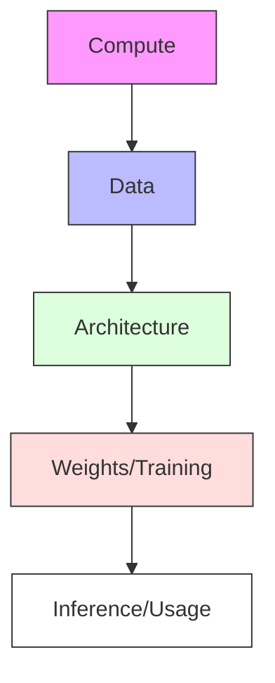

# Chapter 2: The ML Landscape for Engineers

In the previous chapter, we established that your domain expertise is the compass that guides the machine learning process. But to use that compass effectively, you need to understand the terrain you are navigating. 

When you start collaborating with ML engineers, you will encounter a flurry of terms: *transformers, weights, tokens, inference, discriminative, generative*. To the uninitiated, this sounds like a different language. To a professional, however, these are simply the components of a system. 

As someone who has stood where you are—balancing a deep professional specialty with the need to understand these technical systems—I’ve found that the best way to approach the ML landscape is not as a mathematician, but as a systems engineer. You don't need to know how to derive the calculus; you need to know what the components do and how they interact.

---

## 2.1 A Taxonomy of Modern AI: Discriminative vs. Generative Models

At the highest level, almost every AI system you will encounter falls into one of two categories: **Discriminative** or **Generative**. While the line between them is blurring with the advent of modern LLMs, the distinction is fundamental to how you define a problem.

### Discriminative Models: The "Classifier"

A discriminative model is essentially a boundary-maker. Its goal is to look at a set of data and decide which category it belongs to. If you give a discriminative model a thousand images of cells, its job is to tell you: *"This is a healthy cell"* or *"This is a malignant cell."* It is not creating anything new; it is assigning a label based on patterns it has seen before.

> **Discriminative Model:** A type of AI that learns the boundary between classes. It asks: "Given this input, what is the probability that it belongs to Category A versus Category B?"

### Generative Models: The "Creator"

A generative model does not just recognize patterns; it learns how to *reproduce* them. Instead of telling you if a cell is malignant, a generative model would be asked to *"Draw a malignant cell based on the patterns you've learned."* In the context of LLMs, these models generate the next most likely piece of text, effectively "creating" a response.

> **Generative Model:** A type of AI that learns the underlying distribution of the data. It asks: "What does a typical example of this category look like?" and then generates a new example that fits that description.

#### Visualizing the Difference

Think of it as the difference between a judge and an artist. The judge decides if a painting is a forgery; the artist paints a picture in the style of the original.

```mermaid
graph LR
    subgraph Discriminative
        D_In[Input: Image of a Bridge] --> D_Proc[Analyze Features]
        D_Proc --> D_Out[Output: "Safe" or "Unsafe"]
    end

    subgraph Generative
        G_In[Input: "Design a Bridge"] --> G_Proc[Predict Next Token/Pixel]
        G_Proc --> G_Out[Output: New Blueprint/Image]
    end
```

When defining your project, asking *"Do I need this model to categorize my data, or do I need it to create new content?"* will immediately tell you which side of the taxonomy you are on.

---

## 2.2 High-Level Overview of the Stack: Compute $\rightarrow$ Data $\rightarrow$ Architecture $\rightarrow$ Weights $\rightarrow$ Inference

If you look at an ML model as a piece of software, you are missing the point. An ML model is more like a physical engine. It requires raw materials, a blueprint, and a process to "burn in" its capabilities. We refer to this as the **ML Stack**.

### The Production Line of Intelligence

To understand how a model gets from an idea to a working tool, follow the flow of the stack:

#### 1. Compute (The Power Plant)
Compute refers to the hardware—specifically GPUs (Graphics Processing Units) and TPUs (Tensor Processing Units). Unlike a standard computer CPU, which handles tasks one by one, these chips can perform thousands of mathematical calculations simultaneously. Without massive compute, the patterns in your domain data would take decades to process.

#### 2. Data (The Raw Material)
Data is the fuel. This includes the text, images, or sensor readings you provide. As we discussed in Chapter 1, the quality of this data determines the ceiling of the model's performance.

#### 3. Architecture (The Blueprint)
The architecture is the mathematical structure of the model. It's the "design" of the engine. For example, a "Transformer" architecture is designed to handle sequences of data (like text) and understand the relationship between distant parts of that sequence.

#### 4. Weights (The Learned Experience)
When a model is "training," it is adjusting billions of tiny numerical values called **Weights**. 

> **Weights:** The internal parameters of a model that determine how much importance is given to a specific input. Think of them as "dials" that the model turns during training until the output matches the desired result.

By the end of training, the "model" is essentially just a giant file of these weights. The architecture is the empty shell; the weights are the intelligence inside.

#### 5. Inference (The Execution)
Inference is the act of using the trained model to get a result. When you type a prompt into a chatbot and it responds, that is **Inference**. The model is no longer learning; it is simply applying its learned weights to your input to produce an output.

#### The Stack Flow



---

## 2.3 The Engineering MBA Perspective: Cost-benefit analysis of "Build vs. Buy vs. Fine-tune"

Once you understand the stack, you face a strategic decision. In the business world, we call this a "Make vs. Buy" analysis. In ML, we have a third option: "Fine-tune."

### The Three Paths to a Solution

#### 1. Buy (The Off-the-Shelf Approach)
This means using a generalist API (like GPT-4) exactly as it is.
- **Pros:** Instant deployment, no infrastructure cost, leverages the most powerful general intelligence.
- **Cons:** Zero control over the underlying weights, data privacy concerns, "generic" outputs that lack your domain's nuance.

#### 2. Build (The From-Scratch Approach)
This means designing your own architecture and training it on your own data from day one.
- **Pros:** Absolute control, maximum specialization, the model is a proprietary asset.
- **Cons:** Extreme cost (compute), requires a team of PhDs, high risk of failure if the data is insufficient.

#### 3. Fine-tune (The Strategic Hybrid)
This means taking a pre-trained model (which already knows how to "speak" and "reason") and giving it a "crash course" in your specific domain.
- **Pros:** Lower cost than building from scratch, significantly higher domain accuracy than buying, maintains the "reasoning" capabilities of the base model.
- **Cons:** Still requires a high-quality "Gold Dataset" for the fine-tuning phase.

### Decision Matrix for the Domain Expert

| Factor | Buy (Generalist) | Build (Custom) | Fine-tune (Specialist) |
| :--- | :--- | :--- | :--- |
| **Upfront Cost** | Very Low | Very High | Moderate |
| **Time to Market** | Days | Years | Weeks/Months |
| **Control** | None | Absolute | High |
| **Accuracy** | General/Generic | Specialized | High/Nuanced |
| **Requirement** | API Key | Huge Dataset + Compute | Curated "Gold" Dataset |

#### When to choose which?

As a peer, my advice is this: **Start with "Buy" to prove the concept. Move to "Fine-tune" to achieve professional-grade accuracy. Only "Build" if your domain is so obscure that existing models treat it as noise.**

---

## Summary

In this chapter, we've mapped the landscape. You now know that AI is divided between **discriminating** (classifying) and **generating** (creating). You've seen the **ML Stack**, from the raw compute power to the final act of inference. Finally, we've looked at the strategic choice between **Buying, Building, and Fine-tuning**.

You are no longer just a provider of data; you are someone who can look at a project and say, *"We are using a generalist model for a discriminative task, but given the complexity of our domain, we need to move toward a fine-tuned specialist model to reduce the error rate."*

**Prerequisite Check:** If "GPU" or "API" are terms you are unfamiliar with, don't worry. These are the "plumbing" of the digital world. For now, just think of a GPU as a "math accelerator" and an API as a "digital doorway" that lets two pieces of software talk to each other.